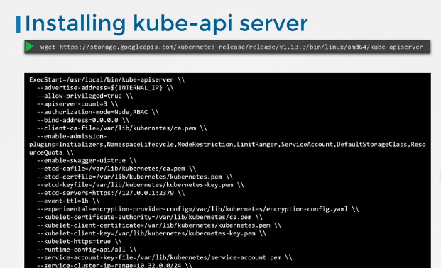

## 1.1 Cluster Architecture

### 1.1.1 Kubernetes Architecture

Purpose of Kubernetes (k8) is to host your applications in the form of containers in an automated fashion so that you can easily deploy as many instances of your application you require and easily enable communication between different services in your application.

The whole Kubernetes architecture is divided into two types of nodes:
1. **Master Node** : Master Nodes are responsible for controlling the worker nodes. Master Node decides which container image will be running on which worker node. The various components of master nodes are :
    * **ETCD**: stores all information related to k8 in a key value format.
    * **Kube Scheduler**: identifies the right node on which the container can be hosted based on size, capacity, taints and tolerants etc.
    * **Controller Manager**: different controllers responsible for controlling different functions like node controller, replication controller etc.
    * **Kube API Server**: orchestrates all operations between the components of the cluster.

1. **Worker Node** : Worker nodes are the actual nodes which are repsonible to host the application container images. The Master Nodes instruct the worker nodes to run the specific container images.
    * **Kubelet**: it is an agent that runs on each node in the cluster. It listens for instructions from the kube api server and deploys or destroys containers on the nodes as required. The Kube API server periodically fetches status report from the kubelet to monitor the state of nodes and containers on them.
    * **Kube Proxy**: ensures that the necessary rules are in place on the worker nodes to allow the containers running on them to reach / interact with each other.


---

## Docker vs ContainerD

Docker was the initial container runtime engine earlier when kubernetes was released untill v1.24. During that time many other container runtime engines (CRE) came into existance like rkt, containerd. So in order to make k8 compatible with other CRE, a new interface was developed called CRI and it required CRE's to adhere to OCI (open container initiatives) standards.

OCI consists of below standards:
* imagespec - how image should be build
* runtimespec - how any container runtime should be built

Docker however did not support OCI as it was built earlier and it was a dominant CRE at that time so k8 developed a feature called dockershim in order to support docker with k8. Docker support was later removed in v1.24. ContainerD became the default CRE with k8.

<br>


<br>


<br>

|||Containerd|Kubernetes Container Runtime Interface (CRI)|
|-|-|-|-|
||ctr|nerdctl|crictl|
|Purpose|Debugging|General Purpose|Debugging|
|Community|ContainerD|ContainerD|Kubernetes|
|Works With|ContainerD|ContainerD|All CRI Compatible Runtimes|

---

<br>

### 1.1.2 ETCD for Beginners

<br>

ETCD is a key value store that is simple, fast and secure.

<br>

### Relational vs Key Value store

<br>

#### Relational Database :

|Name|Age|Location|Salary|Grade|
|-|-|-|-|-|
|John|45|San Fransico|50000||
|Mary|25|New Delhi|10000|A|
|Ram|35|Bangalore|35000|B|

<br>

#### Key Value Store:

|Key|Value|
|-|-|
|Name|John|
|Age|45|
|Location|San Fransico|
|Salary|50000|

|Key|Value|
|-|-|
|Name|Mary|
|Age|25|
|Location|New Delhi|
|Salary|10000|
|Grade|A|

|Key|Value|
|-|-|
|Name|Ram|
|Age|35|
|Location|Bangalore|
|Salary|35000|
|Grade|B|

<br>

### Installing ETCD

<br>

1. Download binaries
1. Extract
1. Run ETCD Service

    * Runs on port 2379

<br>

### Some Commands of ETCD


<br>

* Store information:
    ```
    > ./etcdctl put key1 value1
    > OK
    ```

* Retreive information:
    ```
    > ./etcdctl get key1
    > value1
    ```

* Etcd version:
    ```
    > ./etcdctl --version
    > etcdctl version: 3.3.11
    > API version: 3.3
    ```
* Set etcd version to 3
    ```
    > ETCDCTL_API=3 ./etcdctl version

    > export ETCDCTL_API=3 ./etcdctl version
    ```

---

<br>

### 1.1.3 ETCD in Kubernetes

All information regarding the k8 cluster is stored in ETCD database. For eg. all information retrieved by the Kube API server regarding Nodes, PODS, configs, secrets, roles etc are stored in ETCD. Any change made in the k8 cluster is marked complete when the information is updated in the ETC database.

There are two types of setups of kubernetes:

1. Manual: In this you have to download the etc database binaries and install etcd as a service. While installing etcd as a service there are many option which can be passed to it like ssl certificates, advertise url etc. Below image will show all the various options which can be configured


In order to setup ETC in HA, each etc instance must know about the other using the initial cluster controller option as shown in below image


2. Kubeadm: In this kubernetes setup kubeadm will deploy etcd as a pod in the kube system.

<br>

### 1.1.4 Kube-API Server

Kube API service is the only component which interacts with the ETCD db directly. All other components interact with the Kube API server in order to store information in the ETCD. Whenever some information is requested, the kube api server fetches the information from the ETCD and returns to the client.

Kube API server performs below actions:

1. Authenticates User
1. Validate Request
1. Retreive information
1. Update ETCD
1. Interact with other components like Scheduler/Kubelet and vice versa

In order to install kube api service, download the binary and install as a service. During creation of service, you can pass several options in order to configure the kube api server. These options include etcd database discovery, kubelet configuration, ssl certificates etc.

Some options are shown in below image:



Kube API server configuration locations:
1. In case of Kubeadm setup, configurations are available at below location
    > /etc/kubernetes/manifest/kube-apiserver.yml

1. In non kubeadm setup, configrations can be viewed by viewing the service file at below location
    > /etc/systemd/system/kube-apiserv

    or alternatively you can view running options using ps command
    > ps -aux | grep kube-apiserver

<br>

### 1.1.5 Controller Managers 

A Controller is responsible for continously monitoring the state of other components and bringing them to the desired state. 
For example 
* Node controller: is responsible for watching the status of the nodes and take necessary action to keep applications running.

* Replication Controller: it moitors the replica set and it makes sure desired number of pods are maintained within replca set. If POD dies it creates another one.

Kubernetes Controlller Manager is the brain of the k8. All different controllers are packaged into one called Kubernetes Controller Manager and is run as a single process within the k8.

Download Kubernetes Controller Manager binary file, install it and run it as a service. There are various options you can pass when you run it as a service.


In order to view the options of the k8 controller manager

* If your k8 is setup using kubeadm, kubeadm installs it as a pod in the kube-system namespace on the master node. So you can see the options within the pod definition file located at
    > /etc/kubernetes/manifests/kube-controller-manager.yaml

* In a non kubeadm setup, you can view the options in the kube-controller-manager service file location at the services directory
    > /etc/systemd/system/kube-controller-manager.service

    or you can also view it in the running process using below command:
    > ps -aux | grep kube-controller-manager
<br>

### 1.1.6 Kube Scheduler

The main purpose of the Kube Scheduler is to decide which pod needs to be run on which node. It does not run the pod on the node because that is the job of kubelet.

In order to decide which node will be suitable to host the pod it performs certain processes as mentioned below:

* Filter Nodes: The first thing kube scheduler does in order to decide which pod goes on which node is to filter out all the nodes which do not meet the resource quota limits of the pod.

* Rank Nodes: The next thing the kube scheduler does is to rank the nodes on which it would be beneficial to host the pod. for instance there are 2 node in the below diagram which meet the criteria of hosting the pod. The node with 12 CPUs will have 2 CPUs left if the pod is run on it whereas, the node with 16 CPUs would have 6 CPUs left if the pod is run on it. Which makes 16 CPU node a better fit.


In order to install, you can download kube scheduler binary, run it as a service 
    
    $ wget https://storage.googleapis.com/kubernetes-release/release/v1.13.0/bin/linux/amd64/kube-scheduler


To view kube-scheduler server options:

* In kubeadm setup, kube-scheduler is deployed as a pod in the kube system namespace on the master node. So you can see the options within the pod definition file located at
    > /etc/kubernetes/manifests/kube-scheduler.yaml

* In a non kubeadm setup, you can view the options in the kube-controller-manager service file location at the services directory
    > /etc/systemd/system/kube-scheduler.service

    or you can also view it in the running process using below command:
    > ps -aux | grep kube-scheduler
<br>

### 1.1.7 Kubelet

### 1.1.8 Kube Proxy

<br>
